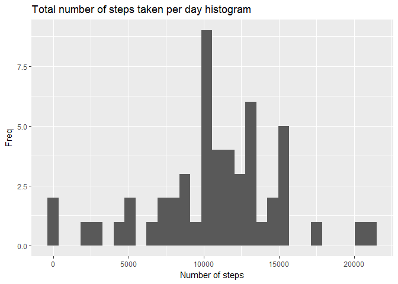
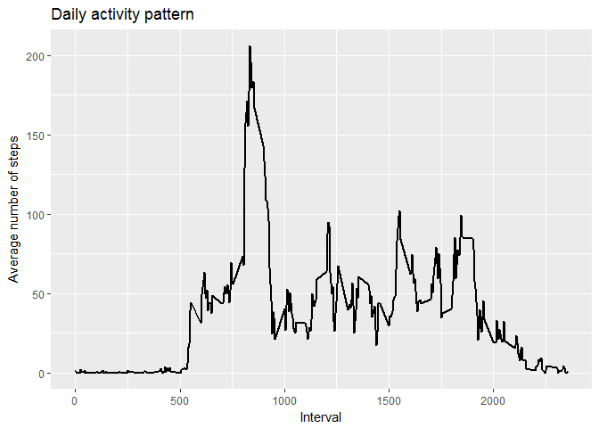
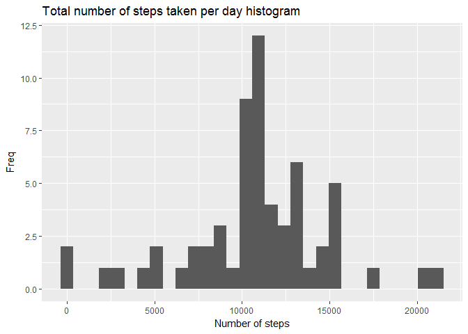
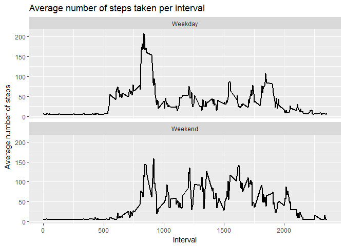

# Reproducible Research: Peer Assessment 1
Aldo Parra  


## Load packages


```r
library(lubridate)
```

```
## 
## Attaching package: 'lubridate'
```

```
## The following object is masked from 'package:base':
## 
##     date
```

```r
library(dplyr)
```

```
## 
## Attaching package: 'dplyr'
```

```
## The following objects are masked from 'package:lubridate':
## 
##     intersect, setdiff, union
```

```
## The following objects are masked from 'package:stats':
## 
##     filter, lag
```

```
## The following objects are masked from 'package:base':
## 
##     intersect, setdiff, setequal, union
```

```r
library(ggplot2)
```


## Loading and preprocessing the data

Unzip the data and load the csv file in a new object, `activity`. Set the `na.strings` argument equal to `"NA"` due missing values are coded as *NA* 


```r
unzip("activity.zip")
activity <- read.csv("activity.csv", stringsAsFactors = F, na.strings = "NA")
head(activity)
```

```
##   steps       date interval
## 1    NA 2012-10-01        0
## 2    NA 2012-10-01        5
## 3    NA 2012-10-01       10
## 4    NA 2012-10-01       15
## 5    NA 2012-10-01       20
## 6    NA 2012-10-01       25
```

Change the **date** column class to Date format


```r
activity$date <- ymd(activity$date)
```

Delete missing values and save a data set with missing values for future analysis


```r
activity_na <- activity
activity <- activity[complete.cases(activity),]
```

## What is mean total number of steps taken per day?

dplyr functions are used to get the total number of steps taken every day


```r
steps_sum <- activity %>% group_by(date) %>% 
    summarise(Total_steps = sum(steps)) %>% 
    print()
```

```
## # A tibble: 53 × 2
##          date Total_steps
##        <date>       <int>
## 1  2012-10-02         126
## 2  2012-10-03       11352
## 3  2012-10-04       12116
## 4  2012-10-05       13294
## 5  2012-10-06       15420
## 6  2012-10-07       11015
## 7  2012-10-09       12811
## 8  2012-10-10        9900
## 9  2012-10-11       10304
## 10 2012-10-12       17382
## # ... with 43 more rows
```


Mean and median 

```r
mean(steps_sum$Total_steps)
```

```
## [1] 10766.19
```

```r
median(steps_sum$Total_steps)
```

```
## [1] 10765
```


```r
ggplot(steps_sum, aes(Total_steps)) +
    geom_histogram() +
    labs(title = "Total number of steps taken per day histogram", x = "Number of steps", y = "Freq")
```

```
## `stat_bin()` using `bins = 30`. Pick better value with `binwidth`.
```

<!-- -->


## What is the average daily activity pattern?

Number of average steps per day

```r
steps_m <- activity %>% group_by(interval) %>% 
    summarise(Steps_mean = mean(steps))
```


Time series plot

```r
ggplot(steps_m, aes(interval, Steps_mean)) +
    geom_line(size = 1) +
    labs(title = "Daily activity pattern", y = "Average number of steps", x = "Interval")
```

<!-- -->


## Imputing missing values

Total number of missing values in the dataset

```r
sum(!complete.cases(activity_na))
```

```
## [1] 2304
```

Filling in all of the missing values in the dataset with the mean of steps

```r
activity_na$steps[is.na(activity_na$steps)] <- mean(activity$steps)
```


New dataset equal to the original dataset with the missing data filled in.

```r
activity_full <- activity_na 
```

Histogram, mean and median of the total number of steps taken each day 


```r
steps_sum_full <- activity_full %>% group_by(date) %>% 
    summarise(Total_steps = sum(steps))

mean(steps_sum_full$Total_steps)
```

```
## [1] 10766.19
```

```r
median(steps_sum_full$Total_steps)
```

```
## [1] 10766.19
```

```r
ggplot(steps_sum_full, aes(Total_steps)) +
    geom_histogram() +
    labs(title = "Total number of steps taken per day histogram", x = "Number of steps", y = "Freq")
```

```
## `stat_bin()` using `bins = 30`. Pick better value with `binwidth`.
```

<!-- -->


Notice that there is not significant difference with the previous results due the missing data imputation. This fact is a consequence of the use of the global mean to replace missing data


```r
mean(steps_sum_full$Total_steps) - mean(steps_sum$Total_steps)
```

```
## [1] 0
```

```r
median(steps_sum_full$Total_steps) - median(steps_sum$Total_steps)
```

```
## [1] 1.188679
```

## Are there differences in activity patterns between weekdays and weekends?

Create a new factor variable in the dataset with two levels - "weekday" and "weekend"

```r
activity_full$Weekend <- ifelse(weekdays(activity_full$date) == "sábado" | weekdays(activity_full$date) == "domingo", "Weekend", "Weekday")
activity_full$Weekend <- as.factor(activity_full$Weekend)
```

Panel plot containing a time series plot (i.e. type = "l") of the 5-minute interval (x-axis) and the average number of steps taken, averaged across all weekday days or weekend days (y-axis).

```r
steps_mw <- activity_full %>% group_by(interval, Weekend) %>% 
    summarise(Steps_mean = mean(steps))

ggplot(steps_mw, aes(interval, Steps_mean)) +
    geom_line(size = 1) +
    facet_wrap(~Weekend, ncol = 1) +
    labs(title = "Average number of steps taken per interval", y = "Average number of steps", x = "Interval")
```

<!-- -->

The previus plot shows that there are differenciences in activity patterns between weekdays and weekends. There is less activity at weekend between 0 and 1000 intervals, however, the activity at weekend is greater than on a weekday between the 1000 and highger intervals

Info about the session

```r
sessionInfo()
```

```
## R version 3.3.2 (2016-10-31)
## Platform: x86_64-w64-mingw32/x64 (64-bit)
## Running under: Windows 7 x64 (build 7601) Service Pack 1
## 
## locale:
## [1] LC_COLLATE=Spanish_Mexico.1252  LC_CTYPE=Spanish_Mexico.1252   
## [3] LC_MONETARY=Spanish_Mexico.1252 LC_NUMERIC=C                   
## [5] LC_TIME=Spanish_Mexico.1252    
## 
## attached base packages:
## [1] stats     graphics  grDevices utils     datasets  methods   base     
## 
## other attached packages:
## [1] ggplot2_2.2.1   dplyr_0.5.0     lubridate_1.6.0
## 
## loaded via a namespace (and not attached):
##  [1] Rcpp_0.12.10     digest_0.6.12    rprojroot_1.2    assertthat_0.1  
##  [5] plyr_1.8.4       grid_3.3.2       R6_2.2.0         gtable_0.2.0    
##  [9] DBI_0.6-1        backports_1.0.5  magrittr_1.5     scales_0.4.1    
## [13] evaluate_0.10    stringi_1.1.5    lazyeval_0.2.0   rmarkdown_1.4   
## [17] labeling_0.3     tools_3.3.2      stringr_1.2.0    munsell_0.4.3   
## [21] yaml_2.1.14      colorspace_1.3-2 htmltools_0.3.5  knitr_1.15.1    
## [25] tibble_1.3.0
```


